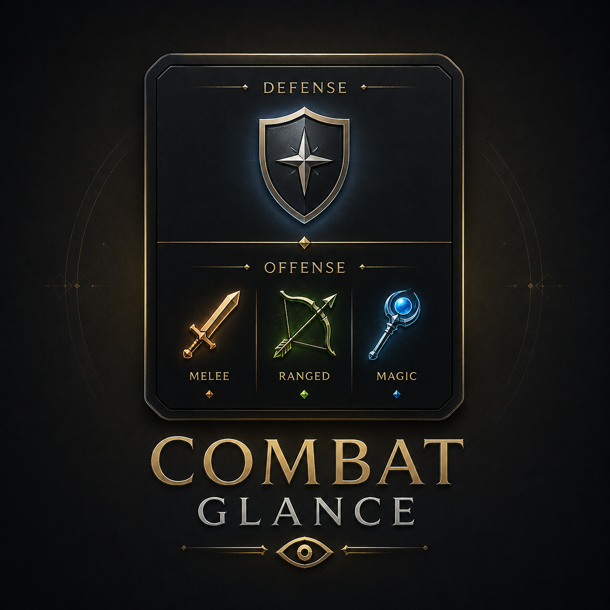

# Combat Glance



A glanceable PvM card that answers one question at a glance: **melee, ranged, or magic — which offensive prayer is on — which overhead is on.**

## Features

- **DEFENSE row** (top) — your active overhead prayer (Protect from Melee/Missiles/Magic, Retribution, Redemption, Smite, Ruinous Dampen, Wrath), or a calm **None**.
- **OFFENSE row** (bottom) — your current attack family (Melee / Ranged / Magic), resolved from equipped weapon *and* selected attack style, plus your active offensive prayer (Piety, Rigour, Augury, single-skill style prayers, and their Ruinous Powers equivalents).
- **Family color-coding** — melee/ranged/magic each get a fixed accent (brown/green/blue) as both a cell border and a subtle tinted fill, applied consistently to both the attack-type cell and the offensive-prayer cell, so a matching pair reads as "the same color twice" at a glance.
- **Learn Mode** (default) — section headers and labels for new players.
- **Compact Mode** — same slot order, no headers, minimal footprint.
- No panel background and no outer card border — just the cells, for a minimal look against the game world. (RuneLite's own overlay-edit-mode highlight still outlines the card while you're repositioning it.)
- Official OSRS sprites only, rendered large and crisp with nearest-neighbor scaling (see [Known limitations](#known-limitations) for why icons are upscaled).
- Optional, off by default: offense/style mismatch highlight (red cell border when the active offensive prayer doesn't match your current attack style).
- Optional, off by default: attack-timer bar — a thin horizontal bar under the attack-style icon showing your swing/cast/cooldown progress, same amber-to-mint fill as the tick track bar, plus a bold centered ticks-remaining number on the (dimmed) icon. Best-effort; hidden whenever the cadence isn't confidently known rather than showing a guess. A light taste of TickFlow's cooldown HUD, not a replacement for it.
- Optional, off by default: tick-progress bar — a generic amber-to-mint tick heartbeat beside the overhead cell, matching TickFlow's square-mode tick-pulse fill visual.
- Optional, off by default: tick sound — the same soft synthesized metronome blip as TickFlow, once per game tick. Unlike TickFlow, there are no mute/volume buttons on the overlay itself — it's a config-panel-only setting, so the card stays a passive readout.
- Optional debug diagnostics: raw prayer names, weapon category, style index, and attack-timer state.
- Movable overlay, adjustable scale (80–140%), no gameplay automation of any kind.

## Screenshots

_Add a screenshot or short GIF of the card in Learn Mode and Compact Mode here before Plugin Hub submission._

## Accuracy disclaimer

Combat Glance is a **passive observation** of client-side state — it never clicks, prays, moves, or recommends anything.

- Prayer state is sampled from the client; network lag can delay the visual by a tick.
- Attack type is inferred from the equipped weapon's style enum and the currently selected attack style — the same enums the core Attack Styles plugin uses. Unknown or exotic weapons fall back to **Melee** rather than guessing.
- When several offensive prayers are active at once, only one **primary** prayer is shown, chosen by a documented, deterministic priority (see `PrayerClassifier` in source, and the product overview).
- This plugin never tells you what you *should* be using. No "wrong prayer" warnings, no boss-specific schedules, no gear recommendations.

## Installation (local development)

Combat Glance is not yet on the Plugin Hub. To run it locally:

1. Clone this repository.
2. Ensure you have a JDK compatible with the RuneLite build (Java 11 target).
3. Run the plugin against a development RuneLite client:

   ```powershell
   .\gradlew.bat run
   ```

   ```bash
   ./gradlew run
   ```

   This launches RuneLite with Combat Glance loaded as a builtin plugin (`--developer-mode --debug`). Enable it from the plugin list like any other plugin.

### Jagex Account login

Development clients require a Jagex Account login. Follow the official guide:

<https://github.com/runelite/runelite/wiki/Using-Jagex-Accounts>

Treat `.runelite/credentials.properties` as a secret. Never print, commit, copy, or share it. Consider invalidating development credentials after testing, per the guide above.

## Build and test commands

```powershell
.\gradlew.bat clean test
.\gradlew.bat build
```

```bash
./gradlew clean test
./gradlew build
```

Both are green as of this writing: 46 unit tests across style mapping, prayer classification, sprite mapping, snapshot/state behavior, the attack-cycle tracker, and the attack-animation allowlist, plus a full `build`.

### Performance notes

`render()` runs every client frame, not every game tick, so allocation there compounds fast. A pre-submission audit found and fixed three real per-frame allocations (the panel frame shape, and — before the attack-timer ring was redesigned into the current bar — its stroke and arc) by caching/reusing scratch objects instead, and fixed one hot-path allocation in `onVarbitChanged` (a boxed-`Integer` `HashSet` lookup on every varbit change client-wide, most of them irrelevant to this plugin) by switching to a sorted `int[]` with binary search. No known allocation hotspots remain in the render or per-tick paths.

### Attack-timer bar: a real bug, and the redesign that fixed it

The first version of the attack-timer feature required a fresh, correctly-timed observation of *every single attack* to keep showing anything, ported from TickFlow's rolling-timeline tracker. In practice it barely showed at all: many weapons don't return to an idle animation between swings, so the only detection signal available (`AnimationChanged`) simply doesn't re-fire for each attack, and a single observation that didn't match the previous prediction discarded all learned state back to "unknown."

It's been rebuilt around a much simpler model: once the weapon's attack speed is known and combat with a target has started, the cycle free-runs every `speedTicks` ticks from that one anchor point — pure tick arithmetic, no drift, no per-attack reconfirmation required. An observed attack (still animation-based, best-effort) re-anchors to self-correct any phase error when it arrives, but a missed or mistimed observation no longer hides the bar. Precision is deliberately traded for reliability — this shows roughly which part of the cycle you're in, not a tick-perfect timeline (that's still TickFlow).

A second, related bug: the "observed attack" signal originally fired on *any* animation change while fighting (`animation > 0`), which is too loose — eating, fletching, and other non-attack animations were re-anchoring the cycle to the wrong tick, making the bar drift out of sync with when attacks actually landed. Fixed with `AttackAnimations`, a bounded, hand-curated allowlist of real attack animation IDs (melee stances, bows/crossbows/blowpipe/thrown ammo, standard-book spellcasting) cross-checked against a real published RuneLite plugin (`ngraves95/attacktimer`) and verified against this project's resolved `AnimationID` constants. It's not exhaustive by design — under-covering is safe since the free-running cycle above keeps the bar showing even without a fresh re-anchor.

## Configuration

All settings live under **Combat Glance** in the RuneLite plugin panel:

| Setting | Default | Description |
|---|---|---|
| Enable overlay | On | Show or hide the card |
| Overlay mode | Learn | Learn (headers + labels) or Compact (slots only) |
| Show text labels | On | Short labels under each icon |
| Overlay scale % | 100 | 80–140% |
| Hide outside combat | Off | Hides the card after ~10s without an interacting target |
| Debug diagnostics | Off | Raw prayer names, weapon category, style index, attack-timer state |
| Highlight offense/style mismatch | Off | Red cell border when the offensive prayer doesn't match the current attack style |
| Show attack timer bar | Off | Horizontal swing/cast/cooldown progress bar under the attack-style icon |
| Show tick track bar | Off | Amber-to-mint tick-progress bar beside the overhead cell |
| Tick sound | Off | Soft metronome blip each game tick (config-panel-only; no overlay buttons) |
| Tick sound volume | 40 | 5–100% |

## Manual validation checklist

Automated unit tests cover the pure logic (style mapping, prayer classification/priority, snapshot/reset behavior, sprite mapping). The following require a live OSRS client and have **not** been performed by an automated agent — run through this list before Plugin Hub submission:

- [ ] Login and enable the plugin; overlay appears and is movable (drag while in overlay-edit mode)
- [ ] Unarmed shows Melee
- [ ] Scimitar/whip/fang show Melee
- [ ] Shortbow/crossbow/blowpipe show Ranged
- [ ] Trident/powered staff show Magic
- [ ] A hybrid staff on a melee style (e.g. Crush) shows Melee; switched to autocast/casting shows Magic
- [ ] Piety / Rigour / Augury each occupy the offense slot when activated
- [ ] Deactivating all offense prayers shows a calm **None**, card does not collapse
- [ ] Protect from Melee / Missiles / Magic each occupy the defense slot with the correct sprite
- [ ] Deactivating the overhead shows **None**
- [ ] Steel Skin / Protect Item / Preserve / Rapid Heal never occupy either slot
- [ ] Weapon swap updates the attack type without restarting the plugin
- [ ] Overhead swap updates promptly enough to be useful mid-fight
- [ ] Logout / world hop / death / plugin disable clears or hides the card
- [ ] Learn Mode and Compact Mode both preserve the fixed slot order (Defense top, Offense bottom)
- [ ] Offense/style mismatch highlight: off by default; when enabled, Rigour-while-meleeing turns the offense border red, Piety-while-meleeing does not
- [ ] Attack-timer bar: off by default; when enabled, bar appears once cadence is confidently known and clears on weapon swap / target change / logout rather than showing a stale value
- [ ] Attack-timer bar, toggled on **while already fighting with a weapon equipped**: bar should still appear (weapon speed is resolved immediately on the toggle, not only on the next weapon swap)
- [ ] Attack-timer bar stays visible/consistent across many consecutive attacks with the same weapon, not just the first one
- [ ] Attack-timer bar shows a legible centered ticks-remaining number on the (dimmed) attack-style icon, in addition to the bar, and it counts down to 0 each cycle
- [ ] Attack-timer bar restarts promptly after each completed attack for common weapon types (a melee weapon, a bow or crossbow, and a standard-spellbook cast), not just on the first attack of a fight
- [ ] Tick track bar: off by default; when enabled, fills and resets every game tick
- [ ] Tick sound: off by default; when enabled, plays a soft blip every game tick at the configured volume, with no controls on the overlay itself; stops immediately when disabled and on plugin shutdown
- [ ] No noticeable FPS impact, no exceptions in the client log

## Known limitations

- **`Client.isPrayerActive` is deprecated upstream** — its javadoc states it "does not properly handle deadeye/eagle eye or mystic vigour/might," because those prayer pairs share one prayer-book slot once the higher tier is unlocked. `CombatGlanceState` mirrors the exact workaround core RuneLite's own Prayer plugin uses (checking the `PRAYER_DEADEYE_UNLOCKED` / `PRAYER_MYSTIC_VIGOUR_UNLOCKED` varbits, and treating Eagle Eye/Mystic Might as inactive once the higher tier is unlocked) so the offense slot never shows a stale lower tier. There is no non-deprecated replacement method on `Client` as of this writing.
- **Icons are deliberately upscaled.** OSRS ships skill/prayer sprites at one small native pixel-art resolution (~25–30px) with no larger official variant — the card renders them at a larger, glanceable size using nearest-neighbor scaling, never bilinear/smooth, so they stay crisp rather than blurring.
- **No rolling history by default.** The card reflects only the current tick's sample — no timeline. That is TickFlow's job. Three narrow, off-by-default toggles (attack-timer bar, tick-progress bar, tick sound) borrow a small piece of TickFlow's audio/visual language for players who want a taste of it without switching plugins, but none of them keep history, and none are a substitute for TickFlow's full timeline.
- **Attack-timer bar trades precision for reliability.** It needs the weapon's known attack speed and one anchor point (when you engaged your current target) before it shows anything — after that it free-runs the cycle from pure tick arithmetic rather than needing to reconfirm every individual attack. An observed attack (animation-based, best-effort) re-anchors to correct any phase drift when it arrives, but a missed one no longer hides the bar. What it can't fully correct for: weapons whose attack animation doesn't reset to idle between swings won't generate re-anchoring observations as often, and other positive-animation actions performed while you have an interacting target (eating, drinking potions) can occasionally be misread as one and shift the phase by a tick or two. If you toggle this setting on mid-session, the currently equipped weapon's attack speed is resolved immediately rather than waiting for the next weapon swap.
- **Tick sound has no in-game controls.** Unlike TickFlow's overlay-embedded mute/volume buttons, the sound toggle and volume live only in the RuneLite config panel — the card itself never grows interactive controls.
- **Ruinous Powers cross-book tie-breaks are effectively untested in real play.** Ruinous Powers replaces the standard prayer book entirely, so a standard-book prayer and a Ruinous prayer are never realistically active at the same time; the deterministic tie-break code path for that case exists but has no real-play scenario to validate against.
- **Lag can delay the visual by a tick**, same as any client-side observation.

## Plugin Hub submission / update steps

Not yet submitted. When ready:

1. Confirm `runelite-plugin.properties` metadata is accurate and `build=standard`.
2. Push this repository to a public GitHub repo (suggested name: `combatglance` or `combat-glance`, same owner as TickFlow).
3. Fork/clone the [plugin-hub](https://github.com/runelite/plugin-hub) repository.
4. Add a manifest file for this plugin containing the repository's HTTPS URL and the exact 40-character commit hash to submit.
5. Open a pull request against plugin-hub and address CI/review feedback.
6. For updates after acceptance, bump `version` in `runelite-plugin.properties` and update the manifest commit hash.

See the official guide for current requirements: <https://github.com/runelite/plugin-hub>

## License

BSD 2-Clause. See [LICENSE](LICENSE).
